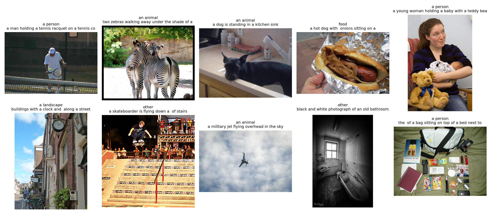
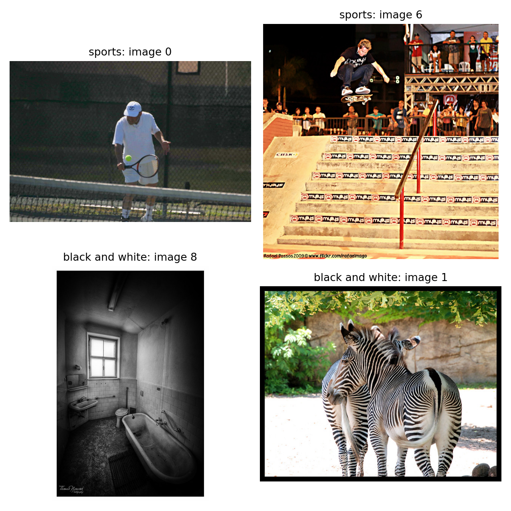
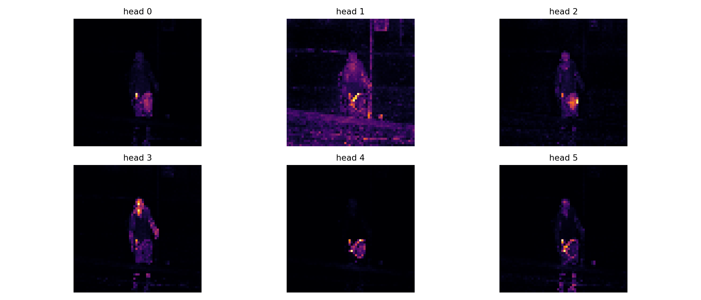
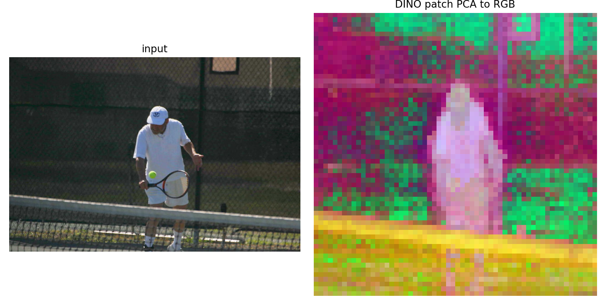
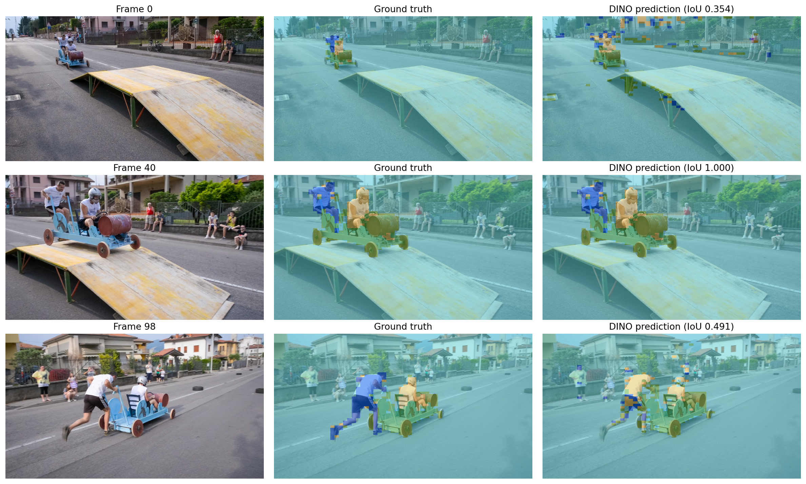

# CS231n Assignment 3 — CLIP 与 DINO 学习总结

## 1. 本次任务

本部分使用两个预训练视觉模型，理解全局视觉—语言对齐和局部视觉表征的区别：

```text
CLIP
Image Encoder + Text Encoder
→ Shared Embedding Space
→ Zero-Shot Classification / Text-to-Image Retrieval

DINO
Vision Transformer
→ Patch-Level Features and Attention
→ PCA Visualization / Lightweight Segmentation
```

真实实验结果：

```text
CLIP model                  = ViT-B/32
CLIP zero-shot agreement    = 9 / 10
Text retrieval              = passed
DINO model                  = ViT-S/8
DAVIS video                 = soapbox, 99 frames, 4 classes
Segmentation training frame = frame 40
Training-frame IoU          = 1.0000
All-frame mean IoU          = 0.5609
Required mean IoU           > 0.55
GPU                         = NVIDIA RTX 4070 Laptop GPU
```

---

## 2. CLIP 在学习什么

CLIP 使用成对的图片和文本训练两个独立编码器：

```text
image → Image Encoder → image embedding
text  → Text Encoder  → text embedding
```

训练目标让匹配的图文 embedding 靠近，让不匹配的图文 embedding 远离。最终，图片和文本被映射到同一个共享语义空间，因此即使没有为某个下游类别专门训练分类器，也能直接比较图片与类别文字。

CLIP 的核心能力不是记住固定分类头，而是学习：

> 哪段文本在语义上最适合描述这张图片？

---

## 3. CLIP 的对比学习与 Batch Size

一个 batch 中有 `N` 对匹配图文。对于每张图片：

- 与其配对的文本是正样本；
- batch 内其他 `N-1` 条文本是负样本。

文本到图片方向同理。较大的 batch size 能提供更多、更丰富的负样本，使模型学习到更有区分度的视觉—语言表示。

如果 batch size 受显存限制，可以增加有效负样本：

- 跨设备收集 embeddings；
- memory queue 或 cross-batch memory；
- hard negative mining；
- 更合适的对比损失与数据增强。

---

## 4. 图文余弦相似度矩阵

设文本特征为：

\[
T\in\mathbb{R}^{N\times D}
\]

图片特征为：

\[
I\in\mathbb{R}^{M\times D}
\]

第 `i` 条文本和第 `j` 张图片的余弦相似度为：

\[
S_{ij}=\frac{T_i^\top I_j}{\lVert T_i\rVert\lVert I_j\rVert}
\]

所有两两相似度可以一次向量化计算：

```python
dot_products = text_features @ image_features.T
text_norms = torch.linalg.norm(text_features, dim=1, keepdim=True)
image_norms = torch.linalg.norm(image_features, dim=1, keepdim=True)
similarity = dot_products / (text_norms @ image_norms.T)
```

输出 shape 为：

```text
(N, M) = (number of texts, number of images)
```

普通点积同时受向量方向和模长影响，而余弦相似度消除了模长影响，更适合比较 embedding 的语义方向。

固定数组验证：

```text
relative error = 8.32e-06
requirement    < 1e-05
```

---

## 5. Zero-Shot Classification

零样本分类不训练新的分类器，而是把类别名作为候选文本：

```text
class names → tokenize → Text Encoder → N text features
images      → preprocess → Image Encoder → M image features
```

随后计算：

```python
similarity = get_similarity_no_loop(text_features, image_features)
pred_indices = similarity.argmax(dim=0)
```

因为相似度矩阵 shape 是 `(N,M)`：

- 第 0 维是 `N` 个类别文本；
- 第 1 维是 `M` 张图片；
- 对 `dim=0` 做 `argmax`，为每张图片从所有类别中选出最高分；
- 最终得到 `M` 个类别索引。

如果误用 `argmax(dim=1)`，得到的是“每条文本最匹配哪张图片”，方向正好相反。

---

## 6. Zero-Shot 为什么能够工作

传统分类器学习固定映射：

```text
image feature → learned class weights → class logits
```

CLIP 则把类别文本本身当作动态分类器：

```text
image feature ↔ text feature of "an animal"
image feature ↔ text feature of "food"
image feature ↔ text feature of "a landscape"
```

只要类别概念已经存在于预训练的共享语义空间，就可以通过修改候选文字增加新类别，而无需为这些类别重新训练参数。

实际运行的 10 张图片中，结果与 Notebook 参考分类有 9 张一致。战斗机图片被预测为 `an animal`，其两个最高分为：

```text
an animal = 0.209759
other     = 0.209704
difference ≈ 0.000055
```

两者几乎打平，说明固定、宽泛的类别文字可能产生歧义；这是模型输出的数值边界情况，不是 `argmax` 或相似度实现错误。



---

## 7. 文本到图片检索

图片库固定而查询文字不断变化，因此最合理的计算方式是：

```text
Initialization:
all images → preprocess → Image Encoder → normalize → cache

Each retrieve(query):
query → Text Encoder → normalize
→ matrix multiplication with cached image features
→ top-k most similar images
```

核心实现：

```python
self.image_features = image_features / torch.linalg.norm(
    image_features, dim=1, keepdim=True
)

text_features = text_features / torch.linalg.norm(
    text_features, dim=1, keepdim=True
)
similarity = text_features @ self.image_features.T
top_indices = similarity[0].topk(k).indices.tolist()
```

这样图片只编码一次，每次检索只需要编码一条新文本并进行一次矩阵乘法。

真实检索结果：

```text
query = sports
top-2 = tennis, skateboard

query = black and white
top-2 = bathroom, zebras
```



---

## 8. 如何扩展到更多模态

共享 embedding 空间并不限于图片和文字。可以为每种模态设计独立编码器：

```text
image → ViT / CNN
text  → Transformer
audio → Audio Encoder
video → Video Encoder
```

各编码器经过 projection head 映射到相同维度并进行归一化。训练时使用多模态对比学习：匹配的跨模态样本相互靠近，不匹配样本相互远离。

结果是表达相同语义的图片、文本、音频和视频可以在同一个 embedding 空间中被比较和检索。

---

## 9. DINO 在学习什么

DINO 是自监督视觉表示学习方法，不需要人工类别标签。学生网络和教师网络观察同一图片的不同增强视图，并学习产生一致表示。

与 CLIP 的图文对齐目标相比，DINO 的训练更专注于视觉内容在不同视图下的结构一致性。它不仅能提供全局 `[CLS]` 表示，还能产生具有明显空间和语义信息的 patch 表示。

因此 DINO 特别适合观察：

- 模型注意哪些物体区域；
- 哪些 patch 具有相似视觉语义；
- patch features 能否直接支持分割等密集预测任务。

---

## 10. ViT Patch Token 的 Shape

本次输入图片为：

```text
img_tensor.shape = (1, 3, 480, 480)
patch size       = 8 × 8
```

每个方向的 patch 数量：

\[
480/8=60
\]

总 patch 数量：

\[
60\times60=3600
\]

ViT 在 patch token 前额外加入一个 `[CLS]` token，因此：

```text
all_tokens.shape   = (1, 3601, 384)
patch_tokens.shape = (1, 3600, 384)
```

去除 `[CLS]` token：

```python
patch_tokens = all_tokens[:, 1:, :]
```

`384` 是 DINO ViT-S/8 的特征维度。每个 patch token 既对应一个空间位置，又携带经过 Transformer 全局信息交互后的高维视觉表示。

---

## 11. DINO Self-Attention 可视化

最后一层 `[CLS]` token 对所有 patch 的 attention 可以还原为 `60×60` 网格。不同 attention head 会关注不同视觉区域，例如：

- 人物主体；
- 手、球拍和球等局部物体；
- 前景与背景的边界；
- 与场景结构有关的区域。

这说明不同 attention head 可以形成互补的区域选择行为，而不是所有 head 都学习相同模式。



---

## 12. Patch Features 的 PCA 可视化

每个 patch 原本有 384 维，无法直接显示。PCA 将其降到 3 维，并把三个主成分映射为 RGB：

```text
(3600, 384)
→ PCA
→ (3600, 3)
→ reshape
→ (60, 60, 3)
```

正确解释 PCA 颜色时需要注意：颜色不是人工类别标签。

- 连续区域颜色相近：这些 patch 的高维特征相似，模型认为它们具有接近的视觉或语义信息；
- 两个区域颜色明显不同：它们的特征向量差异较大，可能属于不同物体或前景与背景；
- 物体轮廓自然出现：同一物体内部 patch 往往相似，而边界两侧特征变化明显。



---

## 13. 用一帧标注训练轻量分割模型

本作业冻结 DINO Encoder，只训练一个非常轻量的 patch 分类器：

```text
DINO patch feature, shape (N, 384)
→ Linear(384, num_classes)
→ logits, shape (N, num_classes)
```

只使用一帧标注，训练复杂网络容易过拟合。DINO 已经提供较强的 patch 表示，因此线性层能够直接检验这些特征的线性可分性，同时减少参数数量和过拟合风险。

本次使用：

```python
self.model = nn.Linear(384, num_classes)
self.optimizer = torch.optim.AdamW(
    self.model.parameters(), lr=1e-2, weight_decay=1e-3
)
self.loss_fn = nn.CrossEntropyLoss()
```

---

## 14. Patch 分类训练与推理

多类别 patch 分类使用 Cross Entropy Loss。一次训练迭代为：

```python
logits = self.model(X_train)
loss = self.loss_fn(logits, Y_train)

self.optimizer.zero_grad()
loss.backward()
self.optimizer.step()
```

由于 DINO Encoder 已冻结，梯度只更新线性分类头。

推理时：

```python
pred_classes = logits.argmax(dim=1)
```

若 logits shape 为 `(N,num_classes)`，`dim=1` 是类别维度，因此输出 `(N,)`，为每个 patch 给出一个类别编号。

最核心的实现链路：

> DINO 提特征，Linear 做分类，Cross Entropy 训练，argmax 出结果。

---

## 15. 从 Patch 分类恢复图像分割

每帧预测得到 3600 个类别：

```text
(3600,)
→ reshape to (60, 60)
→ nearest-neighbor resize to original image size
→ colored segmentation overlay
```

分割标签必须使用 nearest-neighbor resize，不能使用双线性插值。标签是离散类别编号，双线性插值会制造不存在的中间类别值。

DINO patch size 为 `8×8`，因此预测边界天然以 patch 网格为单位，不会像逐像素高分辨率分割网络一样精细。

---

## 16. IoU 指标

类别 `c` 的 Intersection over Union：

\[
IoU_c=\frac{|P_c\cap G_c|}{|P_c\cup G_c|}
\]

多类别 mean IoU 为：

\[
mIoU=\frac{1}{C}\sum_{c=1}^{C}IoU_c
\]

相比像素准确率，IoU 同时惩罚漏分和误分，也不容易被占据大量像素的背景类别掩盖。

真实 DAVIS 实验：

```text
video            = soapbox
frames           = 99
classes          = 4
labeled frame    = 40
frame 40 IoU     = 1.0000
frame 0 IoU      = 0.3541
frame 98 IoU     = 0.4913
all-frame mIoU   = 0.5609
required mIoU    > 0.55
```

训练帧达到 1.0 说明线性头能拟合该帧；其他帧仍保留一定分割能力，说明冻结的 DINO patch features 对视角、位置和时间变化具有迁移能力。



完整 99 帧结果见 [dino_segmentation_comparison.mp4](dino_segmentation_comparison.mp4)。

---

## 17. 为什么 CLIP Patch Features 通常不如 DINO

如果使用 CLIP ViT 的 patch features 训练同样的轻量分割模型，通常预期会比 DINO 更差。

CLIP 的图文对齐目标主要强调全局语义：

```text
Does the whole image match this text description?
```

它可能弱化局部 patch、物体边界和细粒度空间结构。DINO 的自监督目标更关注不同视觉视图下的结构一致性，通常能保留更丰富的 patch-level 信息，因此更适合分割等密集预测任务。

这不是说 CLIP 完全不能用于密集预测，而是其原始预训练目标对全局语义的直接约束更强，局部空间表征不是最主要的优化对象。

---

## 18. CLIP 与 DINO 的对比

| 对比项 | CLIP | DINO |
|---|---|---|
| 训练数据 | 图文对 | 无标签图片 |
| 主要目标 | 图像与文本语义对齐 | 不同视图的视觉表示一致 |
| 强项 | Zero-shot、跨模态检索 | Patch 特征、物体区域与视觉结构 |
| 常用全局表示 | Image/Text embedding | `[CLS]` token |
| 局部表示 | ViT patch tokens，但非主要目标 | 语义结构明显的 patch tokens |
| 本作业任务 | 分类与检索 | 可视化与分割 |

二者不是相互替代关系：CLIP 擅长把视觉连接到语言，DINO 擅长从视觉数据本身学习结构丰富的表示。

---

## 19. 常见易错点

1. **直接用未归一化特征做点积**：结果会同时受方向和模长影响。
2. **余弦相似度矩阵转置错误**：本作业约定输出为 `(texts,images)`。
3. **Zero-shot 使用 `argmax(dim=1)`**：应沿类别维 `dim=0` 为每张图片选类别。
4. **逐张、逐条使用 Python 循环计算相似度**：可以用矩阵乘法一次完成。
5. **每次文本检索都重新编码整个图片库**：图片特征应在初始化时缓存。
6. **只缓存未归一化图片特征**：后续普通矩阵乘法就不再等于余弦相似度。
7. **忘记去掉 DINO 的 `[CLS]` token**：3601 个 token 中只有后 3600 个对应 patch 网格。
8. **把 3601 reshape 为 `60×60`**：必须先去掉第 0 个 token。
9. **把 PCA 颜色当作真实类别**：它只表示降维后的特征相似性。
10. **用大型 MLP 拟合一帧标注**：容易过拟合，也不能清楚检验预训练特征质量。
11. **多类别分割使用 MSE**：应对 logits 和类别编号使用 Cross Entropy。
12. **推理在 patch 维做 argmax**：应沿 `num_classes` 维，即 `dim=1`。
13. **对类别 mask 使用双线性插值**：会产生无效的中间标签。
14. **只观察训练帧 IoU**：应评估整段视频，才能判断特征是否泛化。
15. **期待粗类别 prompt 永远稳定**：接近打平时，数值精度和 prompt 写法都可能改变结果。

---

## 20. 本次知识链路

```text
Image + Candidate Class Texts
→ CLIP Image/Text Encoders
→ Normalized Shared Embeddings
→ Pairwise Cosine Similarity Matrix
→ argmax for Zero-Shot Classification
→ topk for Text-to-Image Retrieval

Image
→ Split into 8×8 Patches
→ DINO ViT-S/8
→ 1 CLS Token + 3600 Patch Tokens
→ Attention / PCA Visualization
→ Frozen Patch Features
→ Linear Patch Classifier
→ 60×60 Segmentation
→ Resize and Evaluate mIoU
```

核心结论：

> CLIP 通过图文对比学习建立跨模态共享语义空间，适合零样本分类与检索；DINO 通过自监督视觉学习获得结构丰富的 patch 表示，只用一帧标注和线性分类头也能在视频中完成具有一定泛化能力的分割。

---

## 21. 复习检查

完成本部分后，应能回答：

1. CLIP 的 Image Encoder 和 Text Encoder 为什么要映射到相同维度？
2. CLIP batch 内的正样本和负样本分别是什么？
3. 为什么较大的 batch size 通常有利于对比学习？
4. batch 受限时，如何增加有效负样本？
5. 如何不用循环计算 `(N,M)` 图文余弦相似度矩阵？
6. 为什么不能直接使用未归一化特征的点积？
7. Zero-shot classification 为什么不需要训练新的分类层？
8. 为什么本作业的分类结果使用 `argmax(dim=0)`？
9. 文本检索为什么要提前缓存图片 embeddings？
10. `topk` 应选择最大相似度还是最小相似度？
11. 如何把图片、文本、音频和视频映射到同一空间？
12. `480×480` 图片经过 ViT-S/8 后为什么有 3600 个 patch？
13. 为什么 `all_tokens` 有 3601 个 token？
14. `[CLS]` token 和 patch tokens 分别适合表达什么？
15. DINO 不同 attention head 可能关注哪些不同区域？
16. PCA 图中相同和不同颜色分别说明什么？
17. 为什么 DINO patch PCA 会显现物体轮廓？
18. 为什么只有一帧标注时适合使用线性分类头？
19. 多类别 patch 分类为什么使用 Cross Entropy Loss？
20. 训练循环中 `zero_grad`、`backward` 和 `step` 分别做什么？
21. `(N,num_classes)` logits 为什么使用 `argmax(dim=1)`？
22. 为什么类别 mask resize 必须使用最近邻插值？
23. IoU 的交集和并集分别代表什么？
24. 为什么不能只用训练帧 IoU 判断模型效果？
25. 为什么 CLIP patch features 通常不如 DINO 适合轻量分割？
