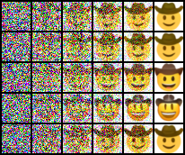

# CS231n Assignment 3 — DDPM 学习总结

## 1. 本次任务

本部分实现一个文本条件 DDPM，用预训练 CLIP 文本向量控制模型生成 `32×32` Emoji。

完整流程：

```text
Clean Image x_0
→ Forward Diffusion q(x_t | x_0)
→ Noisy Image x_t
→ Text-Conditioned U-Net
→ Predict Noise or x_0
→ Reverse Sampling p(x_(t-1) | x_t)
→ Repeat to t = 0
→ Generated Emoji
```

实际生成结果：

```text
Prompt          = face with cowboy hat
Checkpoint      = 70,000 steps
Reverse steps   = 100
Generated batch = 5 images
GPU             = NVIDIA RTX 4070 Laptop GPU
Sampling time   ≈ 5 seconds
```

---

## 2. 扩散模型解决什么问题

扩散模型包含两个方向相反的过程：

```text
Forward process: clean image → gradually add noise → Gaussian noise
Reverse process: Gaussian noise → gradually denoise → generated image
```

前向过程不需要学习，因为每一步加入多少噪声由预先设定的 noise schedule 决定。模型真正学习的是反向过程：给定带噪图片 `x_t` 和时间步 `t`，预测如何去除当前噪声。

与一次性从噪声直接生成图片相比，把任务拆成许多较小的去噪步骤更容易学习。

---

## 3. 前向扩散过程

单步前向过程为：

\[
q(x_t\mid x_{t-1})=
\mathcal{N}\left(\sqrt{1-\beta_t}x_{t-1},\beta_tI\right)
\]

定义：

\[
\alpha_t=1-\beta_t,
\qquad
\bar{\alpha}_t=\prod_{s=1}^{t}\alpha_s
\]

利用高斯分布的性质，可以跳过中间步骤，直接从 `x_0` 得到任意时间步的 `x_t`：

\[
x_t=\sqrt{\bar{\alpha}_t}x_0+
\sqrt{1-\bar{\alpha}_t}\epsilon,
\qquad \epsilon\sim\mathcal{N}(0,I)
\]

当 `t` 增大时：

- `alpha_bar_t` 逐渐减小；
- 原图系数 `sqrt(alpha_bar_t)` 逐渐减小；
- 噪声系数 `sqrt(1-alpha_bar_t)` 逐渐增大；
- `x_t` 最终接近纯高斯噪声。

---

## 4. `q_sample` 的实现

不同 batch 样本可以使用不同时间步，因此需要从预计算的一维系数表中按 `t` 取值，并 reshape 为 `(B,1,1,1)` 以便广播：

```python
signal_scale = extract(self.sqrt_alphas_cumprod, t, x_start.shape)
noise_scale = extract(
    self.sqrt_one_minus_alphas_cumprod, t, x_start.shape
)
x_t = signal_scale * x_start + noise_scale * noise
```

这里的 `extract` 不会复制出与图片一样大的系数张量，而是利用 broadcasting 将每个样本的标量系数作用于它的全部通道和像素。

验证结果：

```text
q_sample error = 5.10e-07
```

---

## 5. `x_t`、`x_0` 与噪声之间的转换

由前向公式可以反推出原图：

\[
x_0=
\frac{x_t-\sqrt{1-\bar{\alpha}_t}\epsilon}
{\sqrt{\bar{\alpha}_t}}
\]

也可以由 `x_t` 和 `x_0` 反推出噪声：

\[
\epsilon=
\frac{x_t-\sqrt{\bar{\alpha}_t}x_0}
{\sqrt{1-\bar{\alpha}_t}}
\]

因此，模型预测噪声与预测原图是两种可以相互转换的参数化方式。

验证结果：

```text
predict_noise_from_start error = 1.06e-06
predict_start_from_noise error = 1.89e-06
```

---

## 6. 为什么使用 U-Net

扩散模型的网络输入和输出具有相同空间尺寸：

```text
input : noisy image x_t, shape (B, 3, H, W)
output: predicted noise or x_0, shape (B, 3, H, W)
```

U-Net 适合逐像素预测，因为它同时使用：

- 下采样路径：扩大感受野，学习更强的全局语义；
- 上采样路径：恢复原始空间分辨率；
- Skip Connection：把浅层的边缘、纹理和位置细节直接交给对应的上采样层。

只有深层特征时，模型虽然理解图片的整体内容，却可能丢失精确空间信息。Skip Connection 让网络同时拥有全局语义和局部细节。

---

## 7. 本作业的 U-Net Block

每个下采样 block：

```text
ResnetBlock(dim_in → dim_in)
→ ResnetBlock(dim_in → dim_in)
→ Downsample(dim_in → dim_out)
```

每个上采样 block：

```text
Upsample(dim_in → dim_out)
→ Concatenate Skip Feature
→ ResnetBlock(2 × dim_out → dim_out)
→ Concatenate Skip Feature
→ ResnetBlock(2 × dim_out → dim_out)
```

拼接后通道数变为 `2 × dim_out`，所以两个上采样 ResNet block 的输入通道都必须考虑 skip feature。

构造测试结果：

```text
U-Net parameter count = 6499
expected count         = 6499
```

参数数量完全一致，说明 block 数量和输入输出通道配置正确。

---

## 8. 时间与文本条件

同一张带噪图片在不同时间步需要不同的去噪强度，因此模型必须知道当前 `t`。

本作业使用正弦时间编码和 MLP：

```text
t
→ SinusoidalPosEmb
→ Linear
→ GELU
→ Linear
→ time context
```

文本条件也通过 MLP 映射到同一个 context 空间：

```text
CLIP text embedding
→ Linear
→ GELU
→ Linear
→ text context
```

最终：

\[
context=time\_context+text\_context
\]

ResNet block 使用 context 预测 scale 和 shift，对卷积特征进行调制：

\[
h'=h\cdot(1+scale)+shift
\]

相比简单相加，scale-shift modulation 可以更灵活地根据时间步和文本改变特征。

---

## 9. Skip Feature 为什么使用栈

U-Net 的上采样路径与下采样路径互为镜像：

```text
first saved high-resolution feature  ← used near the end
last saved low-resolution feature    ← used first
```

因此 skip feature 应按保存顺序的反方向取回，适合使用栈：

```python
skip_connections.append(x)
...
x = torch.cat((x, skip_connections.pop()), dim=1)
```

即后进先出（LIFO）。如果从列表头部按原顺序读取，特征分辨率和网络层级会错位。

每个下采样 block 有两个 ResNet block，所以保存两份特征；对应的上采样 block 也在两个 ResNet block 前分别取回一份。

---

## 10. U-Net 前向传播

完整结构：

```text
Input x_t
→ Initial Conv
→ [ResNet → save → ResNet → save → Downsample] × L
→ Middle ResNet × 2
→ [Upsample → concat/pop → ResNet → concat/pop → ResNet] × L
→ Final 1×1 Conv
→ Prediction
```

验证结果：

```text
output shape                 = (2, 3, 4, 4)
all skip features consumed   = passed
finite outputs and gradients = passed
backpropagation              = passed
```

---

## 11. 去噪训练目标 `p_losses`

每次训练随机采样：

```text
clean image x_0
random timestep t
Gaussian noise epsilon
```

然后：

```text
x_0 + t + epsilon
→ q_sample
→ x_t
→ U-Net(x_t, t, text condition)
→ model prediction
→ weighted MSE
```

当 objective 为 `pred_noise`：

\[
target=\epsilon
\]

当 objective 为 `pred_x_start`：

\[
target=x_0
\]

实现核心：

```python
x_t = self.q_sample(x_start, t, noise)
model_pred = self.model(x_t, t, model_kwargs=model_kwargs)
loss = loss_weight * (model_pred - target) ** 2
loss = loss.mean()
```

---

## 12. 为什么常预测噪声

预测噪声是经典 DDPM 的常见参数化方式，因为：

- 生成 `x_t` 时使用的真实噪声可以直接作为监督 target；
- 噪声来自统一的标准高斯分布；
- 根据 `x_t` 和预测噪声可以恢复 `x_0`；
- 实践中通常具有稳定的训练性质。

直接预测 `x_0` 也合法，只是另一种训练目标。本作业同时支持两种 objective。

本作业定义信噪比：

\[
SNR_t=\frac{\bar{\alpha}_t}{1-\bar{\alpha}_t}
\]

损失权重：

```text
pred_noise   → weight = 1
pred_x_start → weight = SNR_t
```

确定性测试中，两种 objective 的实现都与手工计算的加权 MSE 完全一致。

---

## 13. 后验分布与单步反向采样

如果已知 `x_t` 和预测的 `x_0`，前向过程的后验为：

\[
q(x_{t-1}\mid x_t,x_0)=
\mathcal{N}(\tilde{\mu}_t,\tilde{\beta}_tI)
\]

后验均值可写成 `x_0` 与 `x_t` 的线性组合：

\[
\tilde{\mu}_t=c_1x_0+c_2x_t
\]

`p_sample` 的步骤：

```text
1. U-Net predicts noise or x_0
2. Convert prediction to x_0 if necessary
3. Clamp predicted x_0 to [-1, 1]
4. Compute posterior mean and std
5. Sample x_(t-1) = mean + std × noise
```

裁剪 `x_0` 可以避免预测值在多次反向迭代中不断超出有效图片范围，使采样更稳定。

---

## 14. 为什么 `t=0` 不再加噪声

当 `t>0` 时，`x_(t-1)` 来自具有非零方差的高斯后验，因此需要：

\[
x_{t-1}=\tilde{\mu}_t+\tilde{\sigma}_t z,
\qquad z\sim\mathcal{N}(0,I)
\]

这可以保持反向过程的正确分布和随机性。

当 `t=0` 时，已经到达最终干净样本。如果继续加入噪声，会重新污染结果，因此：

```python
noise = torch.randn_like(x_t) if t[0] > 0 else torch.zeros_like(x_t)
```

确定性测试覆盖了：

```text
pred_noise   + t > 0
pred_noise   + t = 0
pred_x_start + t > 0
pred_x_start + t = 0
```

四种组合均与手算完全一致。

---

## 15. 完整生成过程

生成从纯高斯噪声开始：

```python
img = torch.randn(batch_size, 3, image_size, image_size)
```

随后从 `T-1` 反向迭代到 `0`：

```text
x_T
→ x_(T-1)
→ x_(T-2)
→ ...
→ x_1
→ x_0
```

每一步只去除一部分噪声。实际过程图可以观察到：

```text
random colored noise
→ coarse yellow region
→ approximate face and hat
→ clear cowboy-hat Emoji
```

---

## 16. Classifier-Free Guidance

训练时，模型以一定概率丢弃文本条件：

```text
with condition    → learn epsilon_cond
without condition → learn epsilon_uncond
```

因此同一个 U-Net 同时学会条件预测和无条件预测，不需要额外训练一个分类器。

推理时进行两次前向传播：

```text
conditional   : text_emb = real text embedding
unconditional : text_emb = None / null condition
```

并按下式组合：

\[
\hat{\epsilon}=
(s+1)\epsilon_{cond}-s\epsilon_{uncond}
\]

也可以写成：

\[
\hat{\epsilon}=
\epsilon_{cond}+s(\epsilon_{cond}-\epsilon_{uncond})
\]

差值 `epsilon_cond - epsilon_uncond` 表示文本条件额外产生的预测方向。乘以 guidance scale 后，就会强化文本语义的影响。

---

## 17. Guidance Scale 的权衡

增大 `s` 通常会：

- 提高生成结果与文本条件的匹配程度；
- 降低样本多样性；
- 在过大时产生过饱和、伪影或质量下降。

因此 guidance scale 不是越大越好，而是在条件一致性和多样性之间进行调节。

确定性测试验证：

```text
CFG output = (scale + 1) × conditional - scale × unconditional
```

并确认 `cfg_forward` 不会因为 `pop("cfg_scale")` 修改调用者原本传入的字典。

---

## 18. 预训练 Emoji 生成实验

本次从课程服务器下载：

```text
emoji_data.npz       ≈ 30.0 MB
text_embeddings.pt   ≈ 3.7 MB
model-70000.pt       ≈ 149.6 MB
```

使用预计算文本嵌入，无需再次运行 CLIP 编码器：

```text
prompt       = face with cowboy hat
batch size   = 5
image size   = 32 × 32
timesteps    = 100
checkpoint   = step 70,000
device       = cuda:0
sampling     ≈ 5 seconds
```

5 个样本都生成了明显的黄色笑脸和牛仔帽，说明模型同时学到了 Emoji 数据分布和文本条件。

最终生成结果：


从高斯噪声到 Emoji 的去噪过程：



---

## 19. PyTorch 版本与固定随机测试

课程 Notebook 使用固定 seed 和固定输出数组测试 U-Net、loss、sampling 与 CFG。本地环境为：

```text
PyTorch 2.8.0 + CUDA 12.6
```

U-Net 中包含训练态 `Dropout(0.1)`，不同 PyTorch 版本的随机掩码序列可能不同。因此即使结构和 seed 相同，经过随机 U-Net 后的完整数组也可能与课程环境不完全一致。

本次没有修改正确公式去迎合随机输出，而是拆分为确定性测试：

- 参数数量和各层通道；
- 输出 shape；
- Skip stack 是否完全消费；
- 输出与梯度是否为有限值；
- 反向传播；
- 两种 objective 的手工 loss 对照；
- 四种单步采样组合的手工对照；
- CFG 公式对照。

这些测试均通过。

---

## 20. 常见易错点

1. **把 `alpha_t` 和 `alpha_bar_t` 混淆**：直接从 `x_0` 得到 `x_t` 使用累计乘积 `alpha_bar_t`。
2. **忘记平方根**：信号和噪声系数分别是 `sqrt(alpha_bar_t)` 与 `sqrt(1-alpha_bar_t)`。
3. **所有 batch 样本使用同一个系数**：每个样本可能有不同 `t`，必须按 batch 提取。
4. **系数 shape 无法广播**：应 reshape 为 `(B,1,1,1)`。
5. **模型输入干净图而不是带噪图**：训练时 U-Net 输入必须是 `x_t`。
6. **`pred_noise` 的 target 写成 `x_0`**：target 必须与 objective 一致。
7. **预测噪声后不转换为 `x_0`**：计算后验需要先恢复预测的 `x_0`。
8. **反推 `x_0` 时漏掉除法**：必须除以 `sqrt(alpha_bar_t)`。
9. **不裁剪预测 `x_0`**：可能造成反向迭代数值不稳定。
10. **`t=0` 继续加入噪声**：会污染最终生成结果。
11. **Skip feature 按保存顺序读取**：U-Net 镜像结构要求后进先出。
12. **只保存每个 down block 的一份特征**：本作业每个 block 有两个对应的 ResNet skip。
13. **拼接后仍按单倍通道构造 ResNet block**：输入通道应为 `2 × dim_out`。
14. **没有把 context 传入 ResNet block**：时间和文本条件将无法调制特征。
15. **无条件 CFG 仍传真实文本**：无条件分支必须使用 `None` 或 null condition。
16. **CFG 只做一次前向传播**：条件和无条件预测需要分别计算。
17. **guidance scale 越大越好**：过大会降低多样性并可能损害图像质量。
18. **固定 seed 就一定跨版本得到相同数组**：随机层的具体序列可能受框架版本影响。

---

## 21. 本次知识链路

```text
Noise Schedule beta_t
→ alpha_t and alpha_bar_t
→ Closed-form Forward Sampling q(x_t | x_0)
→ Noisy Image x_t

x_t + timestep + text embedding
→ Conditioned U-Net
→ Predict epsilon or x_0
→ Weighted Denoising Loss

Gaussian x_T
→ Predict x_0
→ Posterior q(x_(t-1) | x_t, x_0)
→ Reverse Sampling
→ Repeat until t = 0
→ Generated Emoji

Conditional Prediction + Unconditional Prediction
→ Classifier-Free Guidance
→ Stronger Text Alignment
```

核心结论：

> DDPM 把复杂的图像生成任务拆成许多简单的去噪步骤；U-Net 负责结合空间特征、时间步和文本条件预测去噪方向，CFG 则在推理时放大文本条件产生的方向。

---

## 22. 复习检查

完成本部分后，应能回答：

1. 前向扩散过程需要学习参数吗？为什么？
2. `beta_t`、`alpha_t` 和 `alpha_bar_t` 分别表示什么？
3. 如何直接由 `x_0` 得到任意时间步的 `x_t`？
4. 随着 `t` 增大，原图信息和噪声比例如何变化？
5. `extract` 为什么要把系数 reshape 为 `(B,1,1,1)`？
6. 如何由 `x_t` 和噪声反推出 `x_0`？
7. 预测噪声与预测 `x_0` 为什么可以相互转换？
8. 为什么 U-Net 适合扩散模型的逐像素预测？
9. 下采样会获得什么，又会损失什么？
10. Skip Connection 如何补回空间细节？
11. 为什么 skip feature 要按后进先出的顺序使用？
12. 时间步如何作为条件输入 ResNet block？
13. 文本条件如何影响 U-Net 特征？
14. `pred_noise` 时模型输出和 target 分别是什么？
15. 为什么经典 DDPM 常使用噪声预测参数化？
16. `p_sample` 为什么要先获得预测的 `x_0`？
17. 为什么要把预测的 `x_0` 裁剪到 `[-1,1]`？
18. 为什么 `t>0` 时要加入随机噪声？
19. 为什么 `t=0` 时不能继续加入噪声？
20. Classifier-Free Guidance 为什么不需要额外分类器？
21. 条件预测与无条件预测分别传入什么文本条件？
22. `epsilon_cond - epsilon_uncond` 表示什么？
23. guidance scale 增大时，文本一致性和多样性如何变化？
24. 为什么固定 seed 的随机网络测试仍可能跨 PyTorch 版本产生差异？
